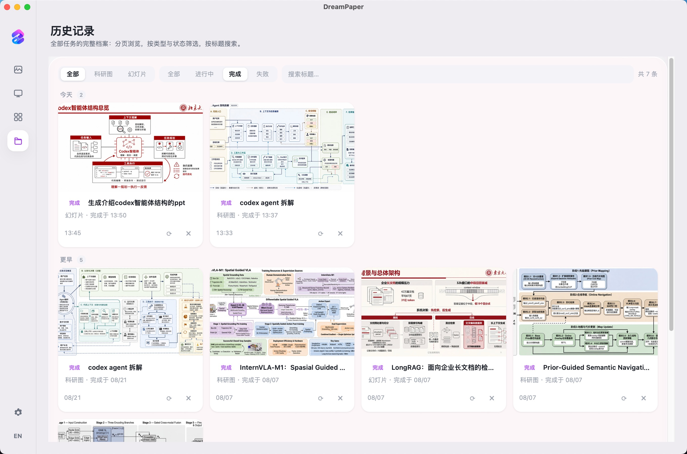
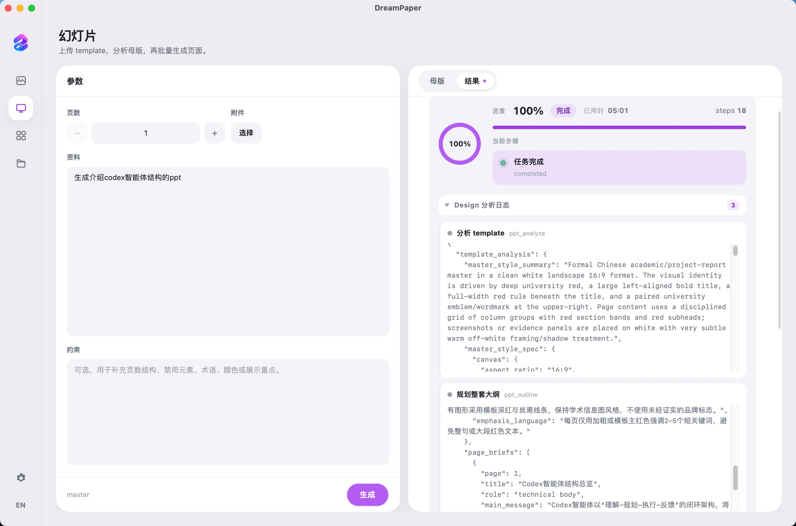

<p align="center">
  
</p>

<h1 align="center">DreamPaper</h1>

<p align="center"><strong>本地科研配图与学术幻灯片，从模板到成图一步到位。</strong></p>

<p align="center">
  
  
  
  
  
  
  
  <a href="LICENSE"></a>
</p>

<p align="center">English: <a href="README_EN.md">README_EN.md</a></p>

---

## 核心优势

- **模板驱动**：科研图以 PaperBananaBench 参考图作 few-shot；幻灯片以你上传的母版锁定版式与配色
- **两阶段设计**：先抽结构 / 母版，再填内容，减少「抄模板文案」与样式漂移
- **模型自选**：Design / Implement / Search 分配置，兼容 OpenAI / Anthropic / image2 / banana2 等协议
- **幻灯片视觉 grounding**：从资料中识别产品与仪器，检索外观描述，引导制图模型画实物而非文字方框
- **全程本地**：配置与产物落在 `~/.dreampaper/`，密钥不进仓库

---

## 更新日志

- 优化历史数据管理页面，可查看完整历史数据记录，一键重试；
- 生图流程透明日志，design model分析内容log 伴随任务进度流式输出；
- 修复了若干bug，流畅度优化。

| 历史数据 | 日志显示 |
| --- | --- | 
|  |  |

## 效果展示

### Desktop

| 科研图 | 幻灯片 |
| --- | --- | 
|  |  |

| 模版库 | 设置页 |
| --- | --- | 
|  |  |

### Web UI

| 科研图 | 幻灯片 | 设置页 |
| --- | --- | --- |
|  |  |  |

### 科研绘图

|  |  |
| --- | --- | 
|  |  |
|  |  |
|  |  |

### 幻灯片

|  |  |  |
| --- | --- | --- |
|  |  |  |
|  |  |  |
|  |  |  |
|  |  |  |
---

## 桌面版下载

不想配 Python 环境的话，直接下[最新 Release](../../releases/latest)。桌面版内置 Rust 后端，无需单独启动服务。

| 文件 | 平台 |
| --- | --- |
| `dreampaper-*-setup.exe` | Windows 安装版（创建桌面快捷方式） |
| `dreampaper-*-portable.exe` | Windows 便携版（免安装） |
| `dreampaper-*-x64-mac.dmg` | macOS Intel |
| `dreampaper-*-arm64-mac.dmg` | macOS Apple Silicon |

### 首次打开

安装包**未做代码签名**（未购买开发者证书），系统会拦一次：

- **macOS**：双击提示「无法验证开发者」。右键点 App → 选「打开」→ 再点一次「打开」。只需操作一次。
- **Windows**：SmartScreen 提示「已保护你的电脑」。点「更多信息」→「仍要运行」。
- **Windows 便携版**依赖系统的 WebView2 运行时。Win11 与 Win10 21H2 及以上已内置；更旧的系统请先装
  [WebView2 Runtime](https://developer.microsoft.com/microsoft-edge/webview2/)，或改用安装版（会自动处理）。

桌面版的配置与产物落在系统应用数据目录，而非 `~/.dreampaper/`：

| 平台 | 路径 |
| --- | --- |
| macOS | `~/Library/Application Support/com.dreampaper.app/` |
| Windows | `%APPDATA%\com.dreampaper.app\` |

---

## 准备 Template 库（科研图）

本仓库**不附带** PaperBananaBench。科研图模式需要本地参考图库。

1. 下载 [PaperBananaBench](https://huggingface.co/datasets/dwzhu/PaperBananaBench)（约 266MB）
2. 解压到仓库根目录，结构如下：

```text
dream-paper/
  PaperBananaBench/
    diagram/
      ref.json
      images/…
    plot/
      ref.json
      images/…
```

3. 重启后端后，科研图页即可选择 1–3 张 template

> 仅用幻灯片模式时可不下载。

**桌面版**不读仓库目录，改在「模板库」页导入：

- **导入模板包**：解压 PaperBananaBench 后，点「选择目录…」选中解压出的那个目录（内含 `diagram/` 与 `plot/`），一次导入全部
- **导入图片**：单张导入自有模板，填类型 / 分类 / 描述即可

导入后的模板复制到应用数据目录，与仓库解耦，换分支或删仓库都不影响。

---

## 本地启动

```bash
python3 -m venv .venv
source .venv/bin/activate   # Windows: .venv\Scripts\activate
pip install -r requirements.txt
npm install
```

```bash
# 终端 1 — 后端
uvicorn backend.app.main:app --reload --host 127.0.0.1 --port 8000

# 终端 2 — 前端
npm run dev
```

打开 http://127.0.0.1:5173

---

## 模型配置介绍

三个角色分开配置，各自独立的协议 / URL / 模型 / 密钥，在「设置」页保存后写入 `~/.dreampaper/config.json`。

1. **`design model`（规划模型，需支持多模态输入）**：负责对用户上传的资料 / 图片进行深度理解，编排目标成图的内容与布局，生成最终的制图描述。强风格一致性约束来自 template 底图。上游模型需支持图像输入，支持 OpenAI / Anthropic 协议。
2. **`implement model`（制图模型）**：接收 `design model` 的输出内容，制作最终的效果图。支持 OpenAI 的 `v1/images/generations` 和 gemini 的协议，可接入 gpt-image-2、nano-banana-2。
3. **`search model`（搜索模型）**：抽取用户输入资料 / 图片中的实物素材，如硬件实物（雷达、相机、无人机等）、软件产品（Claude Code、Codex、Pi 等）。复用现实网络素材图片，辅助 `design model` 进行规划，抑制图像编造，并丰富图像展示效果。可自定义 xAI search（配置 Grok search model）或使用 Tavily，默认 DuckDuckGo。

### 协议下拉

| 角色 | 协议 | 请求端点 | 典型配置 |
| --- | --- | --- | --- |
| design | `openai_responses`（默认） | `{URL}/v1/responses` | `https://api.openai.com` + `gpt-5.4` |
| design | `openai_chat` | `{URL}/v1/chat/completions` | 任意 OpenAI 兼容网关 |
| design | `anthropic_messages` | `{URL}/v1/messages` | `https://api.anthropic.com` |
| implement | `image2`（默认） | `{URL}/v1/images/generations`，带底图时走 `/v1/images/edits` | `https://api.openai.com` + `gpt-image-2` |
| implement | `banana2` | `{URL}/{版本}/interactions` | gemini 协议网关 + `nano-banana-2` |
| search | `duckduckgo_html`（默认） | DuckDuckGo HTML | 免密钥，密钥框自动禁用 |
| search | `tavily` | `{URL}/search` | `https://api.tavily.com`，需 API key |
| search | `openai_chat (search model)` | `{URL}/chat/completions` | `https://api.x.ai/v1` + `grok-3` |

> URL 只填到域名即可，未带 `/v1` 时会自动补全；`banana2` 例外，版本由「版本」字段控制（默认 `v1beta`）。

### 出图参数下拉

`implement` 选 `image2` 时：

| 字段 | 可选值 | 默认 | 说明 |
| --- | --- | --- | --- |
| 尺寸 `size` | `auto` / `16:9` / `1024x1024` / `1200x675` / `928x1664` / `3000x1000` | `1200x675` | OpenAI 尺寸。支持 auto、比例字符串，或任意 宽x高 / 宽*高；尺寸会自动归到最接近比例，并按面积推导 1K/2K/4K。 |
| 质量 `quality` | `auto` / `low` / `medium` / `high` / `hd` | `auto` | 兼容字段；size 为具体尺寸时由尺寸优先推导分辨率；size 为空、auto 或比例时，medium 映射到 2K，high/hd 映射到 4K，其它默认 1K。 |
| 格式 `output_format` | `png` / `jpeg` / `webp` | `png` | 图片格式 |
| response `response_format` | `url` / `b64_json` | `url` | 响应格式，`url` 图片 URL，`b64_json` 图片 Base64 编码 |

`implement` 选 `banana2` 时：

| 字段 | 可选值 | 默认 |
| --- | --- | --- |
| 比例 `aspect_ratio` | `16:9` / `4:3` / `1:1` / `3:2` | `16:9` |
| 清晰度 `image_size` | `1K` / `2K` / `4K` | `4K` |
| 倾向 `thinking_level` | `minimal` / `high` | `high` |
| 格式 `mime_type` | `image/png` / `image/jpeg` / `image/webp` | `image/png` |
| 版本 `api_version` | 手填 | `v1beta` |

### 通用与运行时参数

| 字段 | 适用角色 | 范围 | 默认 / 建议 |
| --- | --- | --- | --- |
| 超时(秒) | 全部 | 5–1800 | design 120；implement 600–900（同步出图慢）；search 15 |
| 重试次数 | 全部 | 0–8 | design 2 / implement 3 / search 1 |
| 流式 | design | 开 / 关 | 关 |
| 结果数 | search | 1–8 | 3 |
| 代理 | 全局 | URL 或端口号 | `http://127.0.0.1:7890`，留空表示不指定代理 |
| 规划并发 | 全局（幻灯片） | 1–20 | 留空 = 跟随页数 |
| 制图并发 | 全局（幻灯片） | 1–20 | 留空 = 跟随页数，建议先设 1 降低网关 502 |

---

## 使用

1. **设置**：配置 Design / Implement（及可选 Search、代理、并发），保存  
2. **科研图**：选 template → 填标题与方法 → 生成  
3. **幻灯片**：上传母版图 → 填资料与页数 → 生成  

| 路径 | 内容 |
| --- | --- |
| `~/.dreampaper/config.json` | 模型配置 |
| `~/.dreampaper/assets/` | 上传文件 |
| `~/.dreampaper/jobs/` | 任务记录与出图 |

---

## 致谢

科研图 template 来自 [PaperBananaBench](https://huggingface.co/datasets/dwzhu/PaperBananaBench)（[PaperBanana](https://github.com/dwzhu-pku/PaperBanana)）。

---

## Star History

<a href="https://www.star-history.com/?repos=dream-rec%2Fdreampaper&type=date&legend=top-left">
 <picture>
   <source media="(prefers-color-scheme: dark)" srcset="https://api.star-history.com/chart?repos=dream-rec/dreampaper&type=date&theme=dark&legend=top-left&sealed_token=ej8Oq3_JvVb6NVk_lL4pi27YYDnqlXQLdD8BpyOsbkS5_HhFb2FGeY4umbQzYpSbSiW47djwIZfrKUTq5S7UnjvVjk9qSjHwZ4_Yko3LxQnqER4FuqXv5A" />
   <source media="(prefers-color-scheme: light)" srcset="https://api.star-history.com/chart?repos=dream-rec/dreampaper&type=date&legend=top-left&sealed_token=ej8Oq3_JvVb6NVk_lL4pi27YYDnqlXQLdD8BpyOsbkS5_HhFb2FGeY4umbQzYpSbSiW47djwIZfrKUTq5S7UnjvVjk9qSjHwZ4_Yko3LxQnqER4FuqXv5A" />
   
 </picture>
</a>

---
## 开源协议

本项目采用 [PolyForm Noncommercial License 1.0.0](LICENSE)，**允许非商业使用，禁止商业使用**。

| 用途 | 是否允许 |
| --- | --- |
| 个人学习、研究、实验、业余项目 | ✅ |
| 阅读、修改源码，二次开发与分发 | ✅（需附带本协议） |
| 公司内部生产使用、对外提供付费或商业服务 | ❌ |
| 将本项目或其衍生版本作为商品出售 | ❌ |
